# 📦 Configuring Github backend

> [!NOTE]
> Every step has screenshots to help you, click on the spoiler to reveal them!

Setting up Github backend may be a little tricky, but if you follow this guide it'll be
piece of cake!~ 🍰

## 1. First steps

Log in or sign up at Github. In this guide, we're assuming you're on desktop 💻

## 2. Creating repository

Click on plus button at the top, and click on 'New repository'

<b>🖼️ Click here to see screenshots</b>

<table><tr><td>

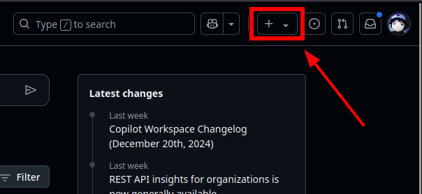
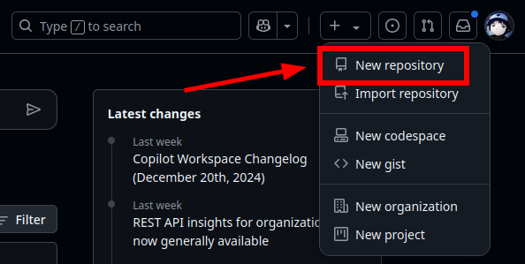

</td></tr></table>

Here, enter any desired name (`monika-autosaves` is a good example), and set it as private

> [!WARNING]
> Your persistent contains all Monika's memories about you &mdash; including private info too. 
> Keep your persistent safe &mdash; make your repository private 🛡️

<b>🖼️ Click here to see screenshots</b>

<table><tr><td>

</td></tr></table>

We're now done setting up the repository &mdash; onto the next step!~

## 3. Generating API token

Go to your settings &mdash; click on your avatar in the top corner, then on 'Settings'

<b>🖼️ Click here to see screenshots</b>

<table><tr><td>

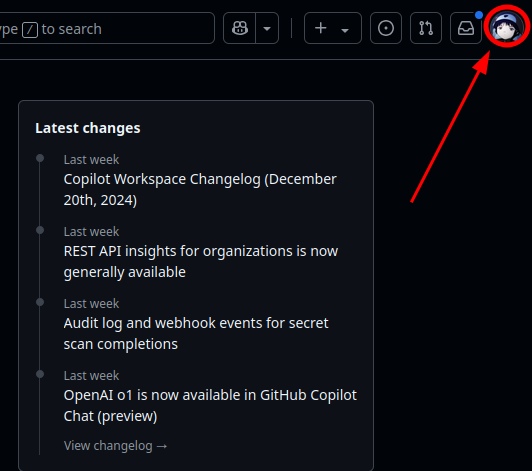
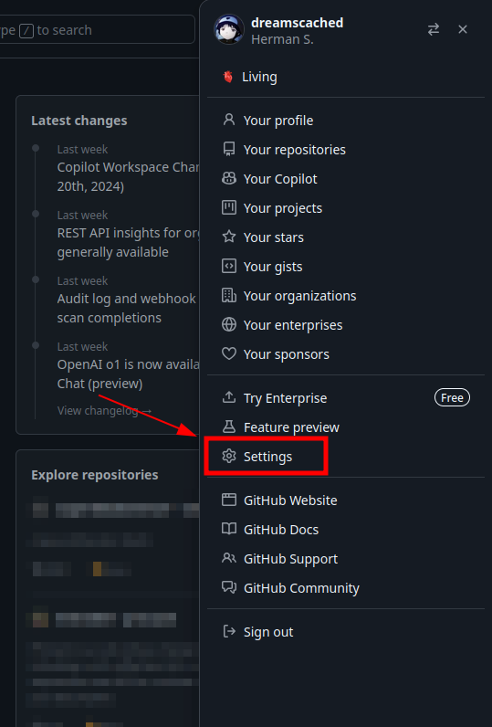

</td></tr></table>

Look to the left, and scroll all the way to the bottom of the menu &mdash; you'll need
the section labelled 'Developer settings'

<b>🖼️ Click here to see screenshots</b>

<table><tr><td>

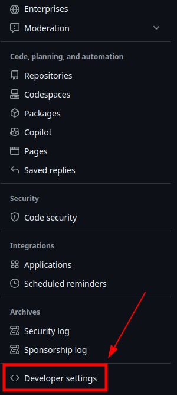

</td></tr></table>

Now, click on 'Personal access tokens' section to unfold it, then on 'Fine-grained tokens'

<b>🖼️ Click here to see screenshots</b>

<table><tr><td>

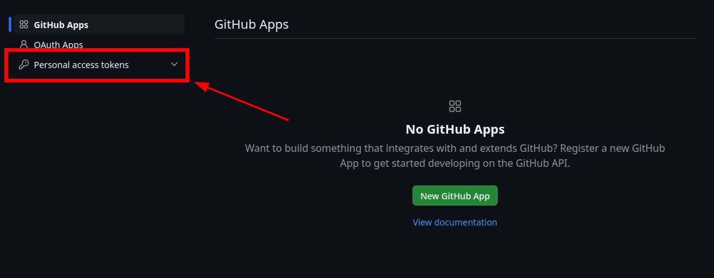
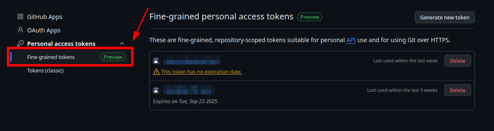

</td></tr></table>

Click on 'Generate new token' button

> [!NOTE]
> You may be asked to enter your password or authorize with 2FA here &mdash; do so if asked

<b>🖼️ Click here to see screenshots</b>

<table><tr><td>

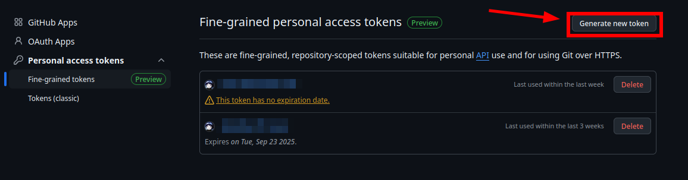

</td></tr></table>

Type anything you like in the 'Token name' field &mdash; it only serves as a label for you;
next up, select 'No expiration' under 'Expiration' field &mdash; so that you won't have to
renew this API token again in future

<b>🖼️ Click here to see screenshots</b>

<table><tr><td>

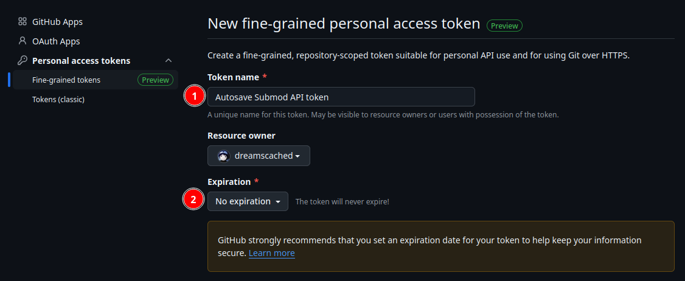

</td></tr></table>

Further on, scroll down to 'Repository access' section; here, click on 'Only select repositories', and select your previously created repository from the list

<b>🖼️ Click here to see screenshots</b>

<table><tr><td>

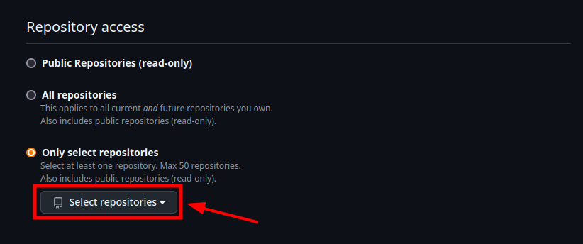
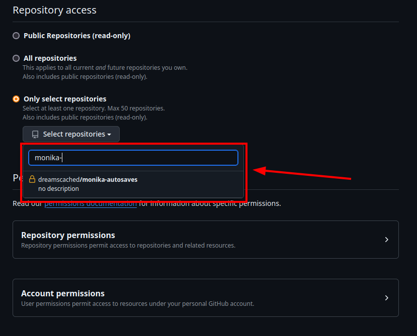

</td></tr></table>

Then scroll down to 'Permissions' section; click on it to unfold, find
'Contents' section and set it to 'Read and write'

<b>🖼️ Click here to see screenshots</b>

<table><tr><td>

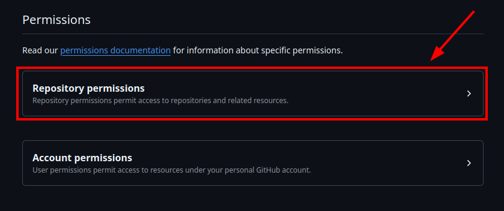
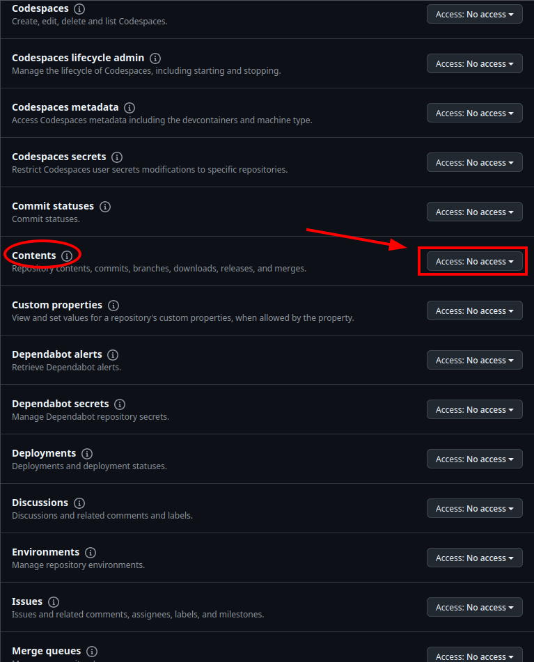
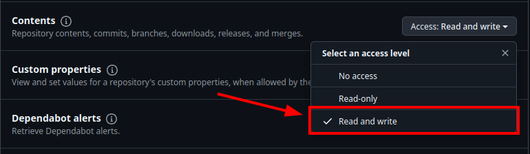

</td></tr></table>

Almost there &mdash; scroll until you see 'Generate token' button and press it, then copy the token using 'copy' button

<b>🖼️ Click here to see screenshots</b>

<table><tr><td>

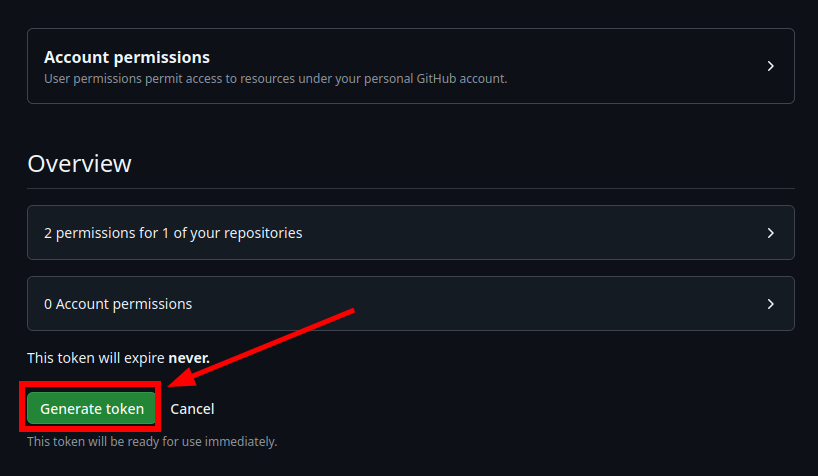
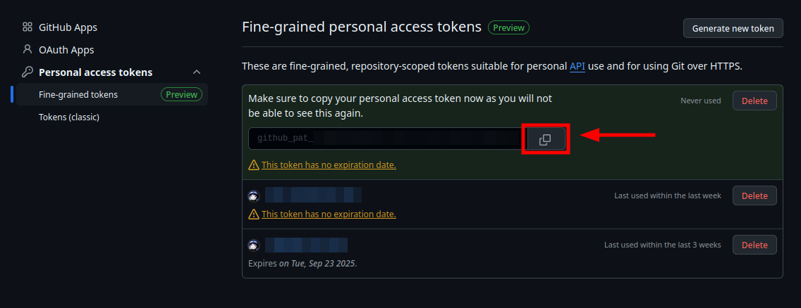

</td></tr></table>

Github stuff is behind us now &mdash; let's set up Autosave submod in game 🎉

## 4. Setting up the submod

Open Submods menu in settings, and click on 'API Keys' section on the left

<b>🖼️ Click here to see screenshots</b>

<table><tr><td>

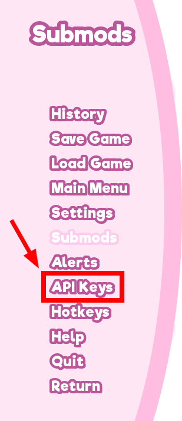

</td></tr></table>

Find '\[Autosave\] Github API token' field, and click 'Paste'

<b>🖼️ Click here to see screenshots</b>

<table><tr><td>

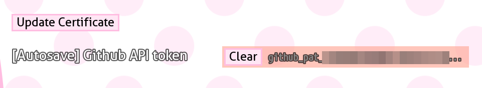

</td></tr></table>

Open 'Submods' section on the left, and find 'Autosave' submod in the list &mdash; then, click 'Select repository' and select your repository from earlier steps

<b>🖼️ Click here to see screenshots</b>

<table><tr><td>

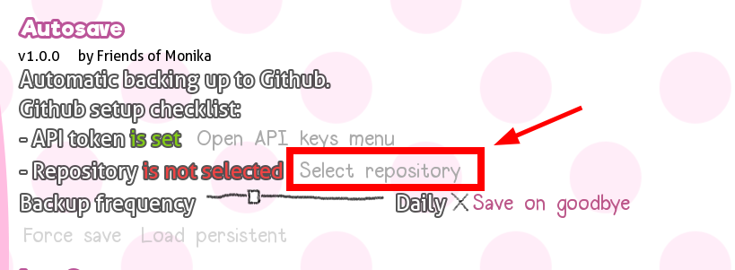
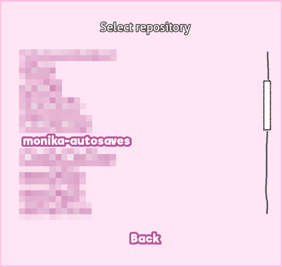

</td></tr></table>

You can check that it works by clicking 'Force save'
and saving your persistent.

<b>🖼️ Click here to see screenshots</b>

<table><tr><td>

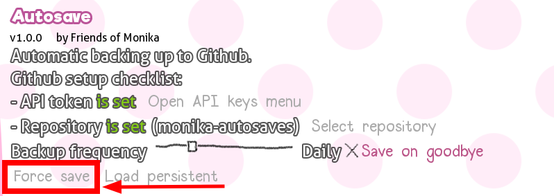
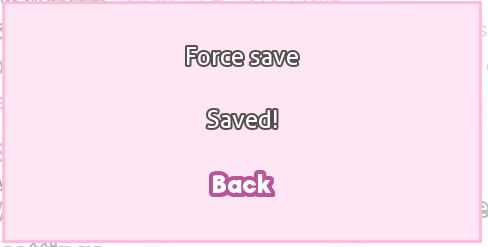

</td></tr></table>

You're all set! 🥳
